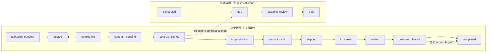

# Testing Accounts & QA Process

> 本文件是 **B2B 交易流程** 的 QA 單一來源：測試帳號、分層驗證流程、端到端走測腳本、
> DB 斷言 SQL、已知缺口與走測紀錄。
>
> **架構對齊（2026-05-19 migration 014）**：訂單為 **12 階段線性狀態機**；
> 付款已抽離至 `payment_schedules`，**不再**使用 `full_prepay` /
> `net_after_arrival` 或 `orders.payment_terms`。舊文件若仍提到 `payment_pending → paid`
> 推進訂單，請以本文件與 [`ARCHITECTURE.md` §4.4–4.5](./ARCHITECTURE.md) 為準。

---

## 0. 快速對照：訂單 vs 付款



| 概念 | 表 / 欄位 | 誰推進 |
|---|---|---|
| 訂單階段 | `orders.status` | Server Actions（`src/actions/order.ts`） |
| 付款期數 | `payment_schedules`（1–10 筆，總和 100%） | 賣家 `draftContract` 時建立 |
| 單次付款提交 | `payments` + `schedule_id` | 買家 `submitPayment` |
| 付款審核 | `payments.status` → verified | **Seller 主審**；Admin 覆審 |
| 訂單結案 | `customs_cleared` → `completed` | 僅當 **所有** schedule 為 `paid` 或 `waived` |

---

## 1. 測試帳號（production: `galloisgraphite.vercel.app`）

| 角色 | Email | Password | 備註 |
|---|---|---|---|
| **Admin (super_admin)** | `[REDACTED]` | `a1234567` | `/admin/*`、付款覆審、force transition |
| **Seller** | `eric.chang.1015+seller@gmail.com` | `a1234567` | 上架、報價、起草合約、出貨、**付款主審** |
| **Buyer** | `eric.chang.1015+buyer@gmail.com` | `a1234567` | 詢價、議價、核准合約、付款、通關確認 |

**Gmail alias**：`+admin` / `+seller` / `+buyer` 會進同一收件夾，Supabase Auth 視為三個帳號。

> ✅ **2026-05-20 起** 通知信走 **AWS SES SMTP**（`src/lib/email/smtp.ts`）。
> `/admin/settings → Send test email` 可驗證連線。

### 1.1 多角色並行登入

- **建議**：Chrome 三個 Profile（或 Edge + Firefox + Chrome），各登一角色，避免 cookie 互搶。
- **首次部署**：admin 的 `profiles.role` 可能仍是 `buyer`，需 SQL 或 `/admin/users` 升為 `super_admin`。
- **Seller 帳號**：在 `/admin/users` 將 `+seller@` 的 role 改為 `seller`。
- **Commercial profile**：`createInquiry` / `createListing` / `submitPayment` 要求 `company_name` + `country` 非空；缺欄時到 `/settings?prompt=incomplete` 補齊。

### 1.2 SMS（可選）

1. `.env` 設 `SMS_BASE_URL`、`SMS_APP_ID`
2. Admin → `/admin/settings` 開啟 SMS
3. 買賣双方在 `/settings` 填 phone（含國碼）
4. 走一筆訂單流程，確認閘道收到 SMS

觸發點見 [`ARCHITECTURE.md` §8](./ARCHITECTURE.md#8-通知系統)。

---

## 2. QA 流程（分層）

每次發版或改動 **訂單 / 付款 / 合約 / 站內信** 相關程式時，依序執行下列層級。**不可**只做 `npm run build` 就宣告交易流程通過。

### Tier 0 — 環境與 schema（約 2 分鐘）

```bash
npm run qa:preflight
```

等同：

```bash
npm run build
node scripts/apply-migrations.mjs --status
node scripts/verify-schema.mjs
```

**通過標準**：build exit 0；所有 migration 已套用；`payment_schedules` 存在、`orders.payment_terms` 已不存在。

改動 **站內信（A2）** 時，額外執行：

```bash
npm run qa:chat
```

**通過標準**：7 項全過（單一 party thread、RLS 雙向讀寫、`chat_rooms` denorm）。詳見 **§3.5**。

改動 **KYC（A6）** 時，額外執行：

```bash
npm run qa:kyc
```

**通過標準**：16 項全過（bucket、門檻預設 0、self-level guard、上傳、`kyc_docs`、admin override、gate 邏輯）。詳見 **§3.6**。

### Tier 1 — 靜態與型別

```bash
npm run lint
npm run build
```

### Tier 2 — 手動 E2E（交易核心，約 30–45 分鐘）

執行 **§3 情境 A**（必做）與 **§4 情境 B**（建議，驗證分期與結案閘門）。

走測結束後：

```bash
node scripts/check-dev-errors.mjs
```

（需先跑過 `npm run dev` 並在瀏覽器走過相關頁面。）

### Tier 3 — 旁支與 regression（發版前）

| 項目 | 腳本章節 | 狀態 |
|---|---|---|
| Dispute / Cancel | §6 | 待各跑一次 |
| Admin force transition | §6 | 待跑 |
| Pay Early（`scheduled` → 提前付款） | §3 D1 變體 | 2026-05-20 已煙霧通過 |
| Seller reject payment | Payment Tab | 建議補 |
| Contract reject + re-draft | §3 C1 變體 | 建議補 |
| `PROFILE_INCOMPLETE` gate | 清空 settings 後試 inquiry | 建議補 |
| Google OAuth 註冊 | ROADMAP A7 | production 待補 |

### Tier 4 — 清理測試資料

```bash
node scripts/cleanup-test-data.mjs
```

會刪除 title 為 `TEST · MADA1%` / `SMOKE · %` / `BROWSER · %` 的 listings 及連帶列。

### 加速：跳過 A/B 上架議價

若只驗證合約以後流程：

```bash
node scripts/seed-test-order.mjs
```

會建立 `contract_pending` 訂單（`ORD-TEST-*`），輸出 `order_id` 後直接開 `/orders/{id}`。

---

## 3.5 站內信（Party DM）— 合併 main 前必跑

**模型**：同一 buyer + seller 僅一條 `chat_rooms.type='party'` thread；訊息可帶
`context_type`（listing / inquiry / order），不另開房。可在無訂單前從 Market 開聊。

### 自動化（Tier 0+）

```bash
npm run qa:chat
```

| TC | 斷言 |
|---|---|
| TC-IM-00 | 該 pair 僅一個 party room；無 legacy `type=order` room |
| TC-IM-01 | Buyer RLS insert |
| TC-IM-02 | Seller 讀取 + 回覆 |
| TC-IM-03 | Buyer 看到回覆 |
| TC-IM-04 | `last_message_preview`、party 欄位、無 `order_id` |

**依賴 migration**：`016_chat_room_denorm` → `018_party_chat`（`npm run db:migrate`）。

### 手動 UI（約 5 分鐘，建議合併前跑一次）

| # | 角色 | 動作 | 預期 |
|---|---|---|---|
| M1 | Buyer | `/market` → 任一 listing → **Message** | Sheet 開啟；可送出文字 |
| M2 | Seller | `/messages` | 列表出現 Buyer；點進 thread 可見 M1 訊息 |
| M3 | Seller | 回覆一則 | Buyer 重新開 Sheet 或 `/messages/{buyerId}` 可見 |
| M4 | Buyer | 已有訂單 → `/orders/{id}` Overview → **Message** 賣方 | **同一 thread**（非新房） |
| M5 | Buyer | `/messages/{sellerId}` 全頁 | 與 Sheet 訊息連續；附件僅 image/PDF ≤5MB |

**不應出現**：訂單頁 Communication Tab、`?tab=communication`。

測試帳號見 §1（Buyer / Seller 同密碼 `a1234567`）。

---

## 3.6 KYC（A6）— 合併 main 前必跑

**模型**（migration 020）：

| Level | 意義 | 如何達成 |
|---|---|---|
| 0 | 信箱登入（Supabase Auth） | 註冊預設 |
| 1 | 電話驗證 | `/settings/kyc` SMS OTP（需 `SMS_*` 或 dev `PHONE_OTP_DEV_CODE`） |
| 2 | 身分／文件已審 | Admin 核准 pending 文件（可跳過 Level 1） |
| 3 | 進階／賣家上架 | 僅 Admin 手動 |

`kyc_level` / `phone_verified_at` 使用者不可自改；上傳只寫 `kyc_docs`（status `pending`），不自動升級。
平台門檻：`kyc_min_level_inquiry` / `kyc_min_level_listing`（0–3，預設 **0**）。

### 自動化（Tier 0+）

```bash
npm run qa:kyc
```

| TC | 斷言 |
|---|---|
| TC-KYC-00 | 門檻預設 0；`kyc` bucket 私有；`trg_profiles_guard_kyc_level` |
| TC-KYC-01 | 使用者 UPDATE `kyc_level` 被 trigger 還原 |
| TC-KYC-02 | Seller 可 upload + append `kyc_docs`；level 不變 |
| TC-KYC-03 | Service role 可設 `kyc_level` |
| TC-KYC-04 | `min_level_listing=1` 時 level 0 被擋、level 1 通過 |

**依賴 migration**：`019_kyc_storage_and_settings`（`npm run db:migrate`）。

`verify-schema.mjs` 另含 5 項 KYC schema 斷言（Tier 0 `qa:preflight`）。

### UI 自動化（需 production `start`）

**先**在終端 A 啟動（確認 3000 未被佔用；若 `EADDRINUSE` 先關閉舊 process）：

```bash
npm run build && npm run start
```

**再**在終端 B 跑（腳本會檢查 server 可連線；auth cookie 會依 Supabase 規則自動分塊 >3180B）：

```bash
E2E_BASE_URL=http://127.0.0.1:3000 npm run qa:kyc:e2e
```

> 不要用 `npm run dev` 跑此腳本（與 `e2e-full-trading` 相同，production `start` 才穩定）。
>
> **常見失敗**：改 code 後沒有重新 `build` + 重啟 `start`，瀏覽器會出現
> `This page couldn't load` / chunk 500 — 與 KYC 功能無關，重啟即可。

| TC | 斷言 |
|---|---|
| TC-KYC-UI-01 | Seller `/settings/kyc` 可載入 |
| TC-KYC-UI-02 | Buyer `/settings/kyc` 可載入 |
| TC-KYC-UI-03 | Admin `/admin/settings` 門檻表單；`/admin/users` KYC dialog |

### 手動 UI（約 5 分鐘）

| # | 角色 | 動作 | 預期 |
|---|---|---|---|
| K1 | Seller | `/settings/kyc` 上傳 PDF | Toast 成功；列表出現檔名；level 仍 0 |
| K2 | Admin | `/admin/users` → **KYC** → level 1 → Save | Seller level 變 1；`audit_logs` 有紀錄 |
| K3 | Admin | `/admin/settings` 將 inquiry min 設 **1** | |
| K4 | Buyer (level 0) | Market 詢價 | Toast `KYC_REQUIRED`；導向 `/settings/kyc` |
| K5 | Admin | 門檻恢復 **0** | 詢價可送出 |

---

## 3. 情境 A — 全額預付（100% @ `contract_signed`）

**目的**：最短路徑，覆蓋 12 階段訂單 + 單筆 schedule 付款 + seller 審核 + 自動結案。

**付款排程設定（C1）**：Incoterm `CFR`，一筆 installment：

| category | milestone | percentage |
|---|---|---|
| prepayment | contract_signed | 100 |

### Phase A — 上架（Seller）

| # | 動作 | 預期（UI） | DB 斷言（可選） |
|---|---|---|---|
| A1 | Seller 登入 → `/listings/new` | 表單可填 | — |
| A2 | Category `MADA1`、qty 50 MT、price 4500、CFR、origin Tamatave | zod 通過 | — |
| A3 | Submit | 跳轉 `/listings`；`/market` 可見 | `listings.status='active'` |

### Phase B — 詢價與議價（Buyer ↔ Seller）

| # | 動作 | 預期 | DB |
|---|---|---|---|
| B1 | Buyer → `/market` → listing → `<InquiryDialog />` | toast 成功 | `inquiries.status='pending'`；seller 收 email |
| B2 | Seller → `/inquiries` Received → `<QuotationForm />` | 報價送出 | `quotations.status='sent'`；`inquiries.status='quoted'` |
| B3 | Buyer → `/inquiries/[id]` → Counter（可選） | 議價中 | `inquiries.status='negotiating'` |
| B4 | Buyer → Accept | 導向新訂單 | `orders.status='contract_pending'`；`orders.incoterm` = quotation.incoterm；`inquiries.status='converted'` |

### Phase C — 合約（Seller draft → Buyer approve → 簽名）

| # | 動作 | 預期 | DB |
|---|---|---|---|
| C1 | Seller → `/orders/[id]` Contract → `<ContractDraftForm />`：CFR + **100% contract_signed** → Draft | Buyer 收通知 | `contracts.revision_no=1`；`payment_schedules` 1 列、`status='scheduled'`；`orders.incoterm='CFR'`；order 仍 `contract_pending` |
| C2 | Buyer → Approve Contract | 顯示已核准 | `contracts.buyer_approved_at` 非空 |
| C3 | Seller、Buyer 各上傳簽名 PNG/PDF | 雙方簽名區塊齊 | 雙方 `*_signed_url` 有值 |
| C4 | （C2+C3 完成後自動） | Progress → Contract Signed → **In Production** | `orders.status='in_production'`；`contract_signed` 那筆 schedule → **`due`** |

> **常見錯誤**：未 Approve 就上傳簽名 → 不會自動推進。順序必須 **先 C2 再 C3**。

### Phase D — 付款（不推進訂單狀態）

| # | 動作 | 預期 | DB |
|---|---|---|---|
| D1 | Buyer → Payment Tab → 對 **`due`** 列 Submit：`usdt_trc20` + amount + tx_hash | 待審核 | `payments.status='pending'`；schedule → `awaiting_review`；seller email（admin CC） |
| D2 | Seller → Payment Tab → `<PaymentVerifyActions />` Verify | Buyer 收「verified by Seller」 | `payments.status='verified'`；schedule → `paid`；**`orders.status` 仍 `in_production`** |
| D3 | Seller → Mark Ready to Ship | 狀態更新 | `orders.status='ready_to_ship'` |
| D4 | Seller → `<ShipmentForm />`（B/L、vessel、container、ETD…；B/L/COA 上傳可選） | Shipped | `orders.status='shipped'`；`loaded_onto_vessel` milestone 若 schedule 有綁則變 `due` |
| D5 | Seller → Mark In Transit | — | `in_transit` |
| D6 | 任一方 → Mark Arrived（填 ATA） | — | `arrived`；`arrived_at_port` milestone 觸發 |
| D7 | Buyer → Customs Cleared | 若 D2 已付清 → **Completed** | `customs_cleared`；若仍有未付 schedule → **停在 customs_cleared**，ProgressBar 顯示 Payments outstanding |

**情境 A 在 D7 的結案條件**：僅一筆 schedule 且 D2 已 `paid` → `maybeAutoComplete` → `completed`。

### Phase E — Admin 覆核

| # | 動作 | 預期 |
|---|---|---|
| E1 | Admin → `/admin/orders/[id]` | Timeline 含 quotation / contract / payment / shipping 事件；狀態 `Completed` |
| E2 | Admin → `/admin/payments` | History 可見該筆 verified payment |

### SQL 快查（替換 `{ORDER_ID}`）

```sql
-- 訂單 + 排程 + 最近付款
select o.order_no, o.status, o.incoterm,
       ps.seq, ps.category, ps.milestone, ps.percentage, ps.amount, ps.status as sched_status,
       p.method, p.status as pay_status
  from orders o
  left join payment_schedules ps on ps.order_id = o.id
  left join payments p on p.schedule_id = ps.id
 where o.id = '{ORDER_ID}'
 order by ps.seq nulls last, p.created_at desc;
```

---

## 4. 情境 B — 分期付款（30% 簽約 + 70% 收貨）

**目的**：驗證 **未付清不得 completed**、第二筆 milestone `accepted_by_buyer`、結案閘門。

**C1 排程範例**（CFR）：

| # | category | milestone | % |
|---|---|---|---|
| 1 | prepayment | contract_signed | 30 |
| 2 | postpayment | accepted_by_buyer | 70 |

### 與情境 A 的差異步驟

| 步驟 | 預期 |
|---|---|
| C4 後 | 僅 30% 列為 `due`；70% 仍 `scheduled` |
| D1–D2 | 只付 30%；verify 後 order 可一路推到 `customs_cleared` |
| D7 Buyer Customs Cleared | order → `customs_cleared`；**不會** completed（70% 未付） |
| D8 | 70% 列應變 `due`（`accepted_by_buyer` milestone） |
| D9–D10 | Buyer 再 Submit + Seller Verify 70% |
| D11 | 此時才 `completed`（或 verify 後若已在 customs_cleared 則自動 completed） |

> 此情境可揭露 2026-05-20 已修的 `autoCompleteIfReady` count bug：未付完不得 completed。

---

## 5. Regression 矩陣（交易相關）

| 功能 | 元件 / Action | 情境 A | 情境 B | 備註 |
|---|---|:---:|:---:|---|
| 詢價 | `<InquiryDialog />` / `createInquiry` | ✅ | ✅ | 需 commercial profile |
| 報價 | `<QuotationForm />` | ✅ | ✅ | |
| Counter | `<QuotationActions />` | 可選 | 可選 | |
| Accept → 訂單 | `acceptQuotation` | ✅ | ✅ | incoterm 來自 quotation |
| 合約起草 | `<ContractDraftForm />` + `<PaymentScheduleBuilder />` | ✅ | ✅ | 總和須 100% |
| 買方核准 | `approveContract` | ✅ | ✅ | |
| 簽名上傳 | `<SignedScanUploader />` | ✅ | ✅ | 先 approve |
| 付款提交 | `<PaymentForm />` / `submitPayment` | ✅ | ✅×2 | Pay Early：`scheduled` 也可付 |
| Seller 審核 | `<PaymentVerifyActions />` | ✅ | ✅ | Admin 亦可 |
| 出貨表單 | `<ShipmentForm />` | ✅ | ✅ | B/L 可選 |
| 手動 milestone | `<MilestoneActionButtons />` | 可選 | 可選 | 依排程設計 |
| 進度條 | `<OrderProgressBar />` | ✅ | ✅ | 12 階段 + Payments X/Y |
| 文件中心 | `<OrderDocumentsTab />` | 可選 | 可選 | |
| 站內 IM | `MessageCounterpartyButton` / `/messages` | ✅ | ✅ | Party DM；`npm run qa:chat` |
| KYC | `<KycUploadForm />` / Admin | 可選 | 可選 | `qa:kyc` §3.6 |

---

## 6. Dispute / Cancel / Admin 旁支

| 動作 | 觸發者 | 預期 |
|---|---|---|
| Raise Dispute | 任一方（非終止狀態） | `disputed`；admin email；timeline + audit |
| Cancel Order | 任一方（pre-shipment） | `cancelled` |
| Force Transition | admin / super_admin | 繞過狀態機；`audit_logs` 記 from/to/reason |

**建議走測**：複製一筆測試訂單到 `in_production`，Raise Dispute → Admin force 回 `in_production` 或 `cancelled`。

---

## 7. 已知缺口與阻塞

| # | 項目 | 影響 |
|---|---|---|
| 1 | ~~站內 IM（A2）~~ | ✅ 已實作（party DM）；合併前跑 §3.5 + `qa:chat` |
| 2 | ~~KYC（A6）~~ | ✅ `qa:kyc` + §3.6 |
| 3 | 情境 B 正式走測紀錄 | 邏輯已實作，文件化腳本在本版補上，待人工跑一輪寫入 §8 |
| 4 | dispute / cancel / force | 待 Tier 3 |
| 5 | `bl_date_plus_N` cron | 需 Vercel cron + `bl_date`；日常 E2E 可略 |

已解決（僅供對照）：`order-documents` bucket ✅；SES email ✅；seller-primary payment review ✅。

---

## 8. 走測紀錄

### 2026-05-15 — 舊版 full_prepay 端到端（歷史）

訂單 `ORD-TEST-MP6PL7MZ` 在 **migration 014 之前** 走通；當時訂單仍含 `payment_pending → paid`。
**勿**以此為現行流程標準；現行請用 §3 情境 A。

### 2026-05-20 — Payment seller-review + Pay Early + Email

- `ORD-260520-601b6b`：Pay Early、`scheduled` → seller verify
- `autoCompleteIfReady` count 修正
- `/admin/settings` Send test email 成功

### 2026-05-20 — 站內信 Party DM（API QA）

| 欄位 | 值 |
|---|---|
| 分支 | `cursor/order-im-ad65` → main |
| 自動化 | `npm run qa:preflight` + `npm run qa:chat` — **7/7 pass** |
| 手動 UI | 待填（§3.5 M1–M5） |
| 備註 | migration 016–018；舊 order-room 已合併 |

### （待填）— 情境 B 分期走測

| 欄位 | 值 |
|---|---|
| order_no | |
| 走測人 | |
| 結果 | pass / fail |
| 備註 | |

---

## 9. 變更歷史

| 日期 | 變更 |
|---|---|
| 2026-05-15 | 初版：測試帳號、舊 full_prepay 腳本 |
| 2026-05-20 | Payment seller-review、SES、走測紀錄 |
| 2026-05-20 | **重寫**：對齊 migration 014 / `payment_schedules`；新增 §0–§2 QA 分層、情境 A/B、regression 矩陣、SQL 快查；移除過時 `net_after_arrival` 章節 |
| 2026-05-20 | 站內信 A2：§3.5 party DM QA、`qa:chat`、regression 矩陣更新 |

---

## 附錄：相關腳本

| 腳本 | 用途 |
|---|---|
| `scripts/seed-test-order.mjs` | 建立 `contract_pending` 測試訂單 |
| `scripts/cleanup-test-data.mjs` | 清除 TEST/SMOKE/BROWSER 前綴資料 |
| `scripts/check-dev-errors.mjs` | 分析 `.next/dev/logs/next-development.log` |
| `scripts/verify-schema.mjs` | 斷言 014 + party chat schema |
| `scripts/apply-migrations.mjs --status` | migration 套用狀態 |
| `scripts/qa-chat-buyer-seller.mjs` | Buyer↔Seller party DM RLS（§3.5） |

`package.json` 捷徑：`npm run qa:preflight`、`npm run qa:chat`、`npm run qa:cleanup`、`npm run qa:seed-order`。
